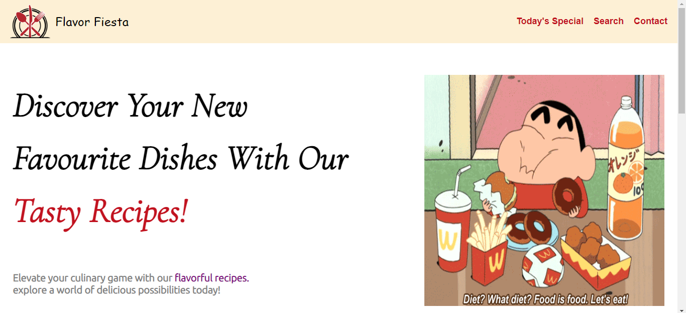
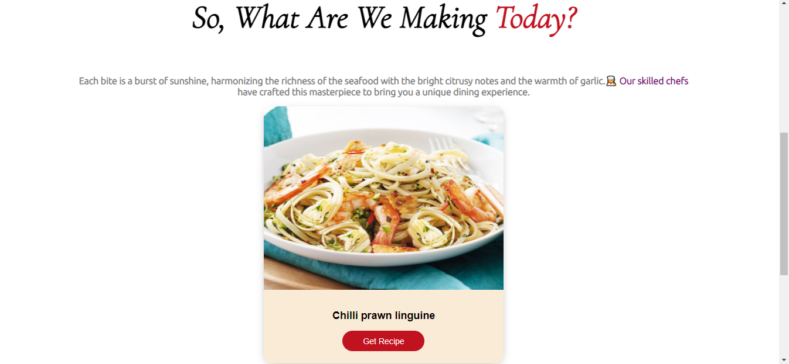
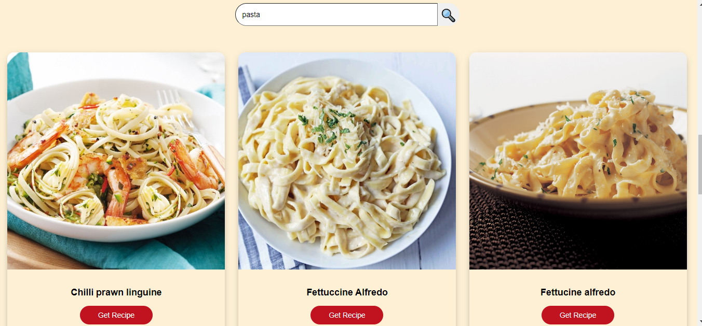
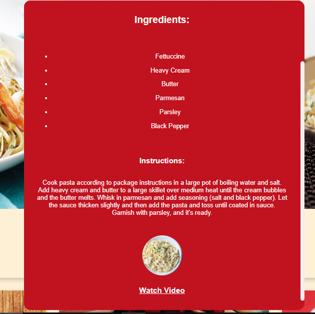

 # Flavor-Fiesta

This repository contains the source code for a responsive recipe website created using HTML, CSS, and JavaScript. The website is designed to showcase delicious recipes with a user-friendly interface. This readme file provides information on how to set up the project, customize it.

## Tech Stack

- HTML: Used for creating the structure of the webpage
- CSS: Used for styling the webpage
- JavaScript: Used for making this functional.

## Features

1. Filter recipes by category or ingredient.
2. Search for recipes using a convenient search bar.
3. Random recipe generator: Every time you refresh the page, a new recipe will appear with its ingredients and instructions.
4. Each recipe includes a YouTube link for visual guidance.
5. Dynamic and responsive design for optimal user experience on both laptops and mobile phones.
6. Recipe data is accessed through the.[TheMealDB API.](https://www.themealdb.com/)

## Screenshots

## Installation

No installation is required! Simply click on the following link. - ( https://kamakship18.github.io/Flavor-Fiesta/ )

## Future Improvements

Seasonal Recipes: In future updates, we plan to add recipes tailored to different seasons, providing a variety of dishes that align with seasonal ingredients and flavors.

## Contributing
Feel free to contribute to the development of this project by submitting issues or pull requests. Your feedback and contributions are highly appreciated.

Happy cooking! 🍳🍲🍰